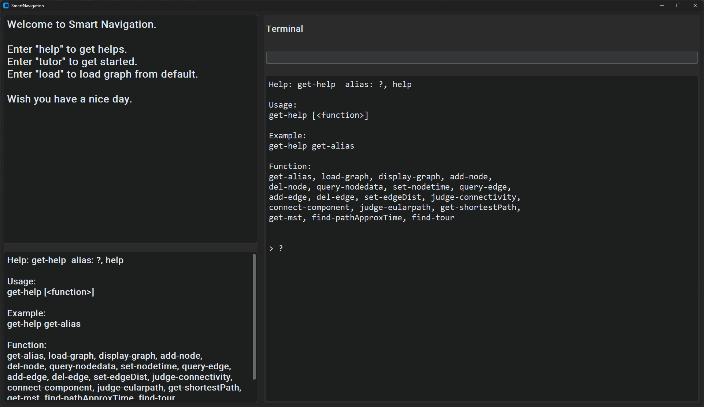

# SmartNavigation

SmartNavigation 是一个基于图论算法的地图导航项目。它支持从用户提供的地图文件中构建带权图模型，并提供包括最短路径、最小生成树、欧拉路径判断、特定节点类型路径遍历等功能。项目集成了图形界面（UI）与命令行接口（CLI），适合教学、科研或轻量导航类应用使用。

---

## 项目结构

```
SmartNavigation/
├── main.py                   # 项目主入口，读取配置、构建图、启动 UI
├── config.json               # 配置文件，定义默认或自定义地图文件路径
├── core/
│   └── graph_util.py         # 核心逻辑模块：图的构建、算法实现（Dijkstra、MST等）
├── app/
│   ├── ui.py                 # 图形用户界面，基于 tkinter 或 ctk 设计
│   └── cli/
│       ├── cli_util.py       # 命令行接口，用于调用图操作函数
│       └── cli_doc.py        # CLI 文档与帮助内容
```

---

## 核心功能



* 读取用户配置或默认地图文件（CSV 格式）
* 节点权重（停留时间）与边权重（路程时间）支持
* 最短路径查找（Dijkstra）
* 最小生成树（MST）
* 欧拉通路与欧拉回路判断
* 强连通判断与自动补边
* 遍历所有特定类型节点的近似最短路径（Steiner-like）
* 图形用户界面（UI）与交互式命令行（CLI）支持

---

## 构建与运行方式

### 依赖管理工具：`uv`

安装依赖：

```bash
uv pip install -r requirements.txt
```

启动项目：

```bash
python main.py
```

---

## 配置说明

项目支持通过根目录下的 `config.json` 进行路径和功能的切换：

```json
{
  "use_custom_file": true,
  "custom_file_path": {
    "node_file": "your_nodes.csv",
    "edge_file": "your_edges.csv"
  }
}
```

若设置 `"use_custom_file": false`，则会加载默认路径文件 `data/ECNU-nodes.csv` 和 `data/ECNU-edges.csv`。

---

## 示例文件格式

### 节点文件（nodes.csv）格式：

```csv
name,node_type,time
A,v1,5
B,v2,3
C,v1,1
```

### 边文件（edges.csv）格式：

```csv
start,end,distance
A,B,10
B,C,7
```

---

## 技术栈与语言构成

| 类型           | 百分比估算 |
| -------------- | ---------- |
| Python         | 85%        |
| JSON (配置)    | 10%        |
| CPython (底层) | 5%         |

构建工具：**uv**（基于 Python 环境的高效包管理器）

---

## 开发者提示

* 所有逻辑均以类和方法组织，便于维护和扩展
* CLI 接口支持灵活调用大多数核心函数
* UI 界面可用于展示路径、配置操作等交互任务
* 代码已清晰分层：**数据、逻辑、交互分离**

---

## Todo / Roadmap

* [ ] 支持带图片背景的地图可视化
* [ ] 节点拖动交互 / 编辑器
* [ ] 完整路径的导出与导入（JSON）
* [ ] TSP（旅行商问题）路径搜索支持（启发式）
* [ ] 自动路线推荐系统

---

## License

MIT License. 本项目可自由使用与修改，欢迎提交 PR。
